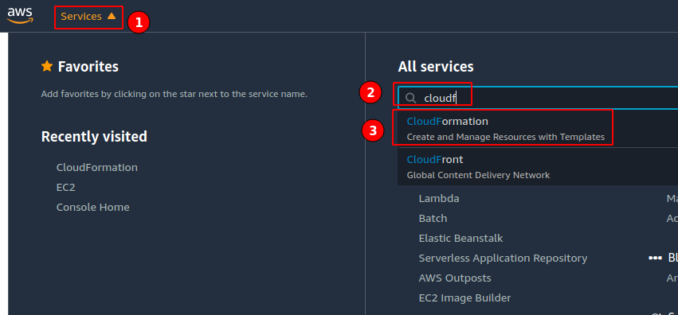

In this post you can learn the steps you need to make to set up InfluxDB on an AWS EC2 instance.

We can group the steps into these high-level phases:

1. Set up an AWS account and an EC2 Virtual Server
2. Set up an AWS EC2 instance
3. Set up InfluxDB on you EC2 instance
4. Try out InfluxDB on your EC2 instance

## Set up an EC2 Virtual Server

In this section we will set up an EC2 Virtual Server. This we need to create our EC2 instance. This phase consists of the following steps:

1. Set up an AWS account
2. Set up an EC2 key pair
3. Set up an AWS user
4. Install and set up the AWS command line client (AWS CLI) on your system

### Set up an AWS account

1. [Create an AWS account](https://aws.amazon.com/free/)
1. Select the appropriate region:
    

### Set up an EC2 Key pair
1. Search for "EC2" in the **Find Services** search box and select **EC2 (Virtual Servers in the Cloud)** (Please not that you have to provide credit card information and it may take up to 24 hours for amazon to activate):
    
1. Select **Key Pairs** and the create a key pair: 
1. Download the keys.
1. Make the key readable only by the owner: `chmod 400 name-of-the-key.pem`

### Set up an AWS user

1. Open **IAM** (Identity and Access Management) from the **Services menu**: 
1. Create a user and grant permissions to it:
    1. Select **Add user**: 
    1. Name the user and add access rights: 
    1. On the **Set Permissions** screen click on **Add user to group** and **Create a group**: 
    1. Define a name and add a policy for the new group: 
    1. At the end of the process you will see your access details: 

    Note that AWS does not save your secret after you close your final screen. On the other hand, you will always be able to create a new key for your users.

### Set up AWS CLI on your system

1. Install the AWS CLI on your system.

    On a linux machine, you can do this as here:

    ```shell
    curl "https://awscli.amazonaws.com/awscli-exe-linux-x86_64.zip" -o "awscliv2.zip"
    unzip awscliv2.zip
    sudo ./aws/install
    ```

    Verify your version:

    ```shell
    aws --version
    ```

    For further instructions [see here](https://docs.aws.amazon.com/cli/latest/userguide/install-cliv2.html).

1. Also create a folder where you will store your keys and your yaml configuration.

    ```shell
    mkdir ~/Projects/influxdb_aws_cloudformation
    cd ~/Projects/influxdb_aws_cloudformation
    mv ~/Downloads/name-of-the-key.pem .
    touch config.yml
    ```
1. Configure AWS with `aws configure`. This is where you need to add your **Access Key ID**, your **Secret Access Key**, and the **region name** (e.g. `eu-central-1`). You can skip the output format.

## Set up an AWS EC2 instance

Open the [Amazon AWS Marketplace](https://aws.amazon.com/marketplace/).

Find a public image


### Define resources

Resources
Logical ID
Instance properties
AMI (Amazon Machine Image) ID

```yaml
Resources:
  Appnode:
    Type: AWS::EC2::Instance
    Properties:
      InstanceType: t2.nano
      ImageId: ami-06a719e5f8e22c33b # The AMI instance ID
      Keyname: InfluxDB_AWS_example # The name of your key pair
      SecurityGroups:
        - !Ref AppnodeSecurityGroup # Reference the security group defined below
```

You need to define a security group. Security groups act as virtual firewalls for your incoming/outgoing traffic with the help of rules. You can read more about them [here](https://docs.aws.amazon.com/AWSEC2/latest/UserGuide/ec2-security-groups.html). Here, we define an [inbound security group](https://docs.aws.amazon.com/AWSCloudFormation/latest/UserGuide/aws-properties-ec2-security-group-ingress.html). For particular rules, [see here](https://docs.aws.amazon.com/vpc/latest/userguide/VPC_SecurityGroups.html#SecurityGroupRules).

We define the security group and link it to our app node definition with the [`Ref` function](https://docs.aws.amazon.com/AWSCloudFormation/latest/UserGuide/intrinsic-function-reference-ref.html).

```yaml
# Define the security group
AppnodeSecurityGroup:
  Type: AWS::EC2::SecurityGroup
  Properties:
    GroupDescription: SSH enabled app nodes
    # Inbound security rule
    # Expose the HTTP port 80 with tcp to inbound traffic from andy Ipv4 addresses
    SecurityGroupIngress:
      - IpProtocol: tcp
        FromPort: '80'
        ToPort: '80'
        CidrIp: 0.0.0.0/0
```

Define Bash script to install docker and influxdb on the image.

The full yaml:

```yaml
Resources:
  AppNode:
    Type: AWS::EC2::Instance
    Properties:
      InstanceType: t2.micro
      ImageId: ami-03d85bfa79ad10274
      KeyName: InfluxDB_AWS_example
      SecurityGroups:
        - !Ref AppNodeSG
  AppNodeSG:
    Type: AWS::EC2::SecurityGroup
    Properties:
      GroupDescription: for the app nodes that allow ssh
      SecurityGroupIngress:
      - IpProtocol: tcp
        FromPort: '80'
        ToPort: '80'
        CidrIp: 0.0.0.0/0
      - IpProtocol: tcp
        FromPort: '22'
        ToPort: '22'
        CidrIp: 0.0.0.0/0
```

### Create a Cloud Formation stack

- 
- 
- 
- On the rest of the screens the only thing you have to do is to name the stack, you can skip the rest of the options.

```shell
aws cloudformation create-stack \
  --stack-name influxdb-trial-stack \
  --region eu-central-1 \
  --template-body file://$PWD/stack.yaml
```

Go back to the EC2 services page and find the instances menu. There you will be able to see your newly created instance. Wait until it finishies initialization and has all of its checkes passed.


### Connect to your instance


Create a connection to our instance:

```bash
ssh -v -i InfluxDB_AWS_example.pem \
  ubuntu@ec2-3-122-XXX-XX.eu-central-1.compute.amazonaws.com
```

## Set up InfluxDB on the EC2 instance

### Install InfluxDB

```bash
wget https://dl.influxdata.com/influxdb/releases/influxdb_2.0.2_amd64.deb
sudo dpkg -i influxdb_2.0.2_amd64.deb
```


Start the influxdb service.

```bash
sudo systemctl start influxdb
```


Setup InfluxDB configuration settings

```bash
influx setup
```

Here you need to add a username, a password, and name your organization and your primary bucket. You can skip on the retention period question.

## Try out InfluxDB

```bash
$ influx bucket list
ID			Name		Retention	Organization ID
61003b98acb988da	_monitoring	168h0m0s	aca7861debe89fb5
62a458b6d3091276	_tasks		72h0m0s		aca7861debe89fb5
d4e2f2ae14c34289	test_bucket	1h0m0s		aca7861debe89fb5
```

```bash
$ date +%s
1606723341
```

```bash
$ influx write -b test_bucket -o nocibambi@gmail.com -p s 'test_measurement,host=testHost testField="testFieldValue" 1606723341'
```

Use Ctrl-D to execute the query.

```bash
$ influx query
from(bucket: "test_bucket") |> range(start:-1h)
Result: _result
Table: keys: [_start, _stop, _field, _measurement, host]
                   _start:time                      _stop:time           _field:string     _measurement:string             host:string                      _time:time           _value:string  
------------------------------  ------------------------------  ----------------------  ----------------------  ----------------------  ------------------------------  ----------------------  
2020-11-30T07:03:07.010273692Z  2020-11-30T08:03:07.010273692Z               testField        test_measurement                testHost  2020-11-30T08:02:21.000000000Z          testFieldValue  
```